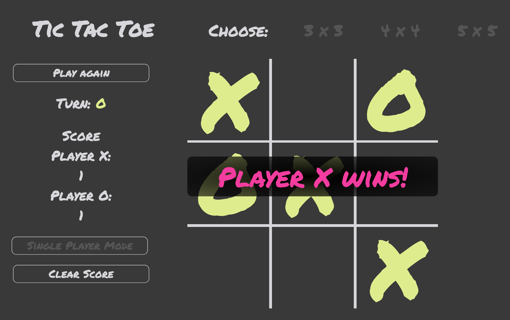

# Tic-tac-toe

**Link:** https://amandachau36.github.io/tic-tac-toe/

## Project 0 for GA's WDI

**Goal:** To build a web application from scratch, without a starter codebase

**Main Features**
* Three board sizes
* However, JS and CSS logic enables allows for any square board size
* Notifies winner/draw games  
* Reset board and play again!
* Tracks score
* Can reset score
* Displays turn
* 2 player or 1 player option - try to beat me!

**Tech Used**
* JS
* HTML
* CSS
* jQuery

**List of bugs**
* Not mobile responsive (but scales well on desktops)
